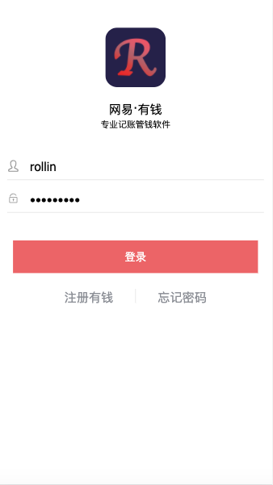
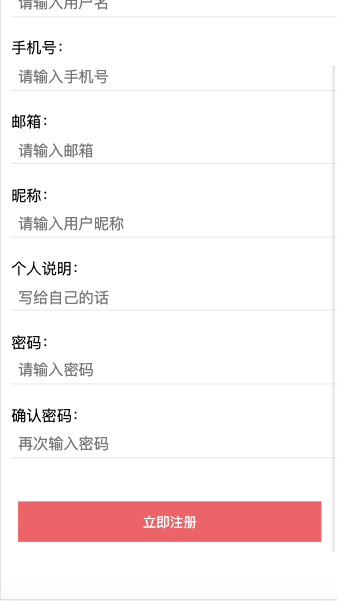
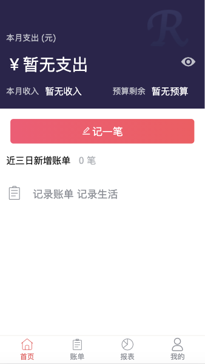
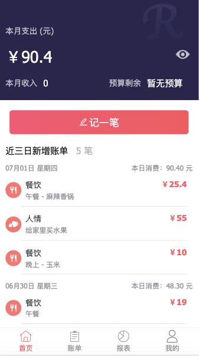
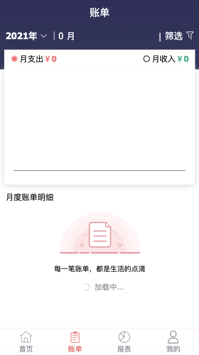
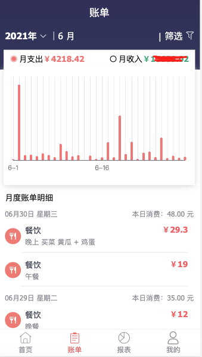
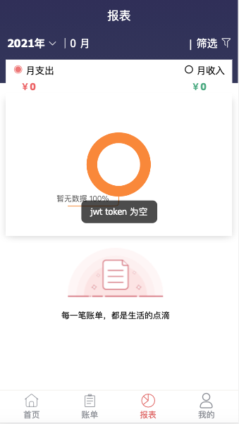
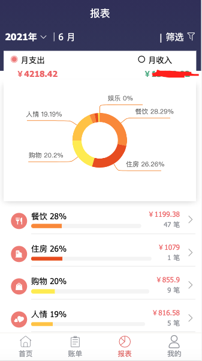
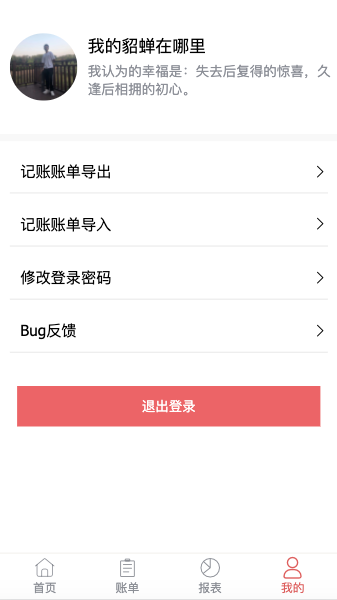
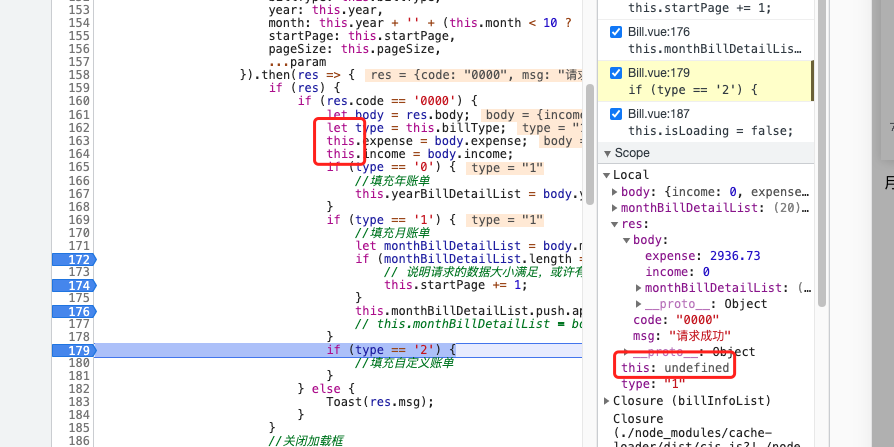

# record-account


### 使用插件
#### 1.使用轮播
https://github.com/surmon-china/vue-awesome-swiper
#### 2.时间格式对象
moment -- 参考地址（https://www.jianshu.com/p/c26d6215b6c6）

### 遇到问题
#### 1.在首页的时候，跳转到其它界面，首页父组件内容报错，因为先销毁子组件，再销毁父组件。

#### 2.处理精度问题：

​    res = (parseFloat(moneyArr[0]) * 10000 + parseFloat(moneyArr[1]) * 10000) / 10000;

#### 3.输入框圆角问题，在全局样式rest.css 中 input下输入border-radius

#### 4.vue2.0中debugger调试this为undefined，但打印有值的问题

##### 原因：

1.箭头函数内的 this 和封闭的局部变量一样
2.箭头函数内的 this 被babel 打包后重命名了

##### 解决：

安装插件

```
npm i babel-plugin-transform-es2015-arrow-functions --save-dev
```

然后在.babelrc或者是babel.config.js 配置文件中加入

```
plugins: [["transform-es2015-arrow-functions", { spec: true }]]
```

### 框架说明
1.缓存数据策略： 请求数据时，会根据传入的三个参数（getCache，setCache，showLoading, localStorageId）进行判断相应的缓存策略；
    1.1 getCache 类型：boolean  说明：默认为true,从缓存中获取。
    1.2 setCache 类型：boolean  说明：默认为true,存储到缓存中。
    1.3 showLoading 类型：boolean  说明：默认为true,为true时显示加载框。
    1.5 localStorageId 类型：string  说明：如果传入则以该字符串作为缓存内容的key，否则为请求方法为key。

2.在登录的时候存储一个是否需要更新接口的标志(updateObj)，默认为{}, 如果为true时，此时访问的接口就需要为重新更新数据。
    2.1 如何请求服务时，调用set时，自动添加当前的 {localStorageId: false},表示当前key可以不需要重新加载数据了。
    2.2 当重新登录后需要重置该对象为{}
    2.3 当记账后成功后，还对象也会被重置。
    2.4 localStorageId除了为false的情况，其它情况均需要重新加载数据。


### 打包说明
    1.npm run build //打包生产包
    2.npm run serve //测试运行

### NGINX 配置说明
#### 1.配置信息  C:\Users\Administrator\Desktop\nginx\nginx-1.12.2\conf\nginx.conf
```
    server {
        listen       9002; # 配置端口
        server_name  localhost; # 请求服务的名称

        location / {
            root   C:/Users/Administrator/Desktop/nginx/record-account; # 指定前端的根路径
            index  index.html index.htm;
        }
		
		location /record-account/ {
			proxy_pass http://127.0.0.1:9008/;
		}
	}
```
#### 2.服务命令相关：
```
开启Nginx服务器：$ start nginx.exe
停止Nginx服务器：$ nginx.exe -s stop
查看服务状态：$ nginx.exe -t
```

### UI 展示

#### 1.登录注册

<div style="background: #4eab7f; width: 100%; text-align: center;padding:10px 0px;">
	
  
</div>

#### 2.首页
<div style="background: #4eab7f; width: 100%; text-align: center;padding:10px 0px;">
	
	
</div>

#### 3.账单
<div style="background: #4eab7f; width: 100%; text-align: center;padding:10px 0px;">
	
	
</div>

#### 4.报表
<div style="background: #4eab7f; width: 100%; text-align: center;padding:10px 0px;">
	
	
</div>

#### 5.我的
<div style="background: #4eab7f; width: 100%; text-align: center;padding:10px 0px;">
	
</div>


### 知识点学习

#### 1.数组追加数组的方式。

##### 1.1 concat

```javascript
 var a = [1,2,3];
 var b = [4,5,6];
 var c = a.concat(b);//c=[1,2,3,4,5,6];
```

缺点浪费内存。

##### 1.2 for循环

```javascript
for(var i in b){
  a.push(b[i]);
}
```

缺点 丑~~~~

##### 1.3 apply

```javascript
a.push.apply(a,b);
```

##### 1.4 扩展运算符

```js
var a = [1,2,3];
var b = [4,5,6];
var newA = [...a,...b]
```

#### 2.调试的时候this无值

##### 2.1 示例图

<div style="width: 100%; text-align: center;padding:10px 0px;">
	
</div>

##### 2.2 解决方案

**原因**

​	1.箭头函数内的 this 和封闭的局部变量一样
​	2.箭头函数内的 this 被babel 打包后重命名了

**安装插件**

```
npm i babel-plugin-transform-es2015-arrow-functions --save-dev
```

**然后在.babelrc或者是babel.config.js 配置文件中加入**

```
plugins: [["transform-es2015-arrow-functions", { spec: true }]]
```


